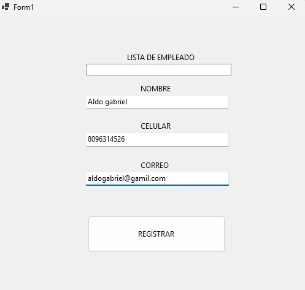
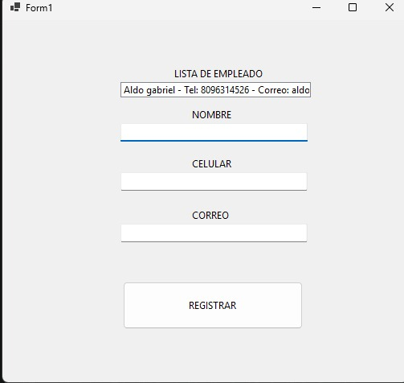

# Ejercicio 4 : Registro de Clientes

## Descripción
Este programa consiste en un formulario interactivo para registrar información de clientes asegurando la correcta entrada de sus datos.

La aplicación funciona mediante los siguientes componentes:
* **Campos de Texto (TextBoxes):** Reciben la entrada de datos del cliente para su **nombre**, **teléfono** y **correo electrónico**.
* **Validación de Campos:** Verifica que los campos no estén vacíos y que la información ingresada cumpla con el formato correcto antes de proceder con el registro.
* **ListBox:** Acumula y despliega la lista con los clientes registrados exitosamente en la sesión.

---

## 📷 Documentación
Captura de pantalla correspondiente al funcionamiento del programa:

